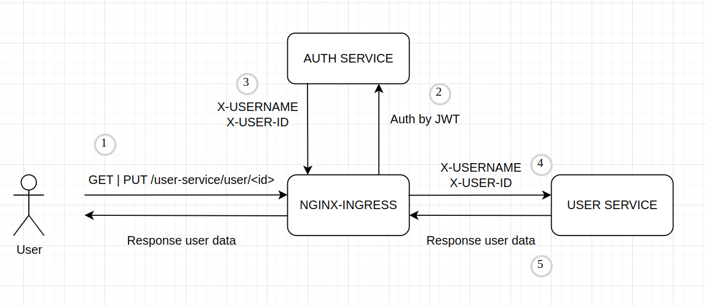

### Запуск приложения

#### Запуск сервиса аутентификации
```shell
kubectl create namespace abdalovalex-l6-auth && helm install auth-service helm/auth-service --namespace abdalovalex-l6-auth
```

#### Запуск сервиса пользователя
```shell
kubectl create namespace abdalovalex-l6-user && helm install user-service helm/user-service --namespace abdalovalex-l6-user
```

1. До установки запускаются следующие ресурсы:
   1. Запуск БД
   2. Установка ConfigMap и Secret
   3. Запуск Job c миграциями. Job ждет запуска БД.
2. Запуск Deployment

Для порядка запуска используются initContainer и helm hook.  
ConfigMap и Secret забирает приложение(инструмент SpringCloudKubernetes), для этого создан ServiceAccount 
с ограниченными ролями для приложения.

### Запуск тестов
```shell
newman run ./tests/tests.json
```
```
newman

otus_l6

→ Регистрация пользователя 1
  POST http://arch.homework/auth-service/auth/sign-up [201 Created, 412B, 136ms]
  ✓  Регистрация пользователя 1

→ Получение профиля пользователя 1 без авторизации
  GET http://arch.homework/user-service/user/3 [403 Forbidden, 279B, 16ms]
  ✓  Получение профиля пользователя 1 без авторизации

→ Изменение профиля пользователя 1 без авторизации
  PUT http://arch.homework/user-service/user/3 [403 Forbidden, 279B, 6ms]
  ✓  Изменение профиля пользователя 1 без авторизации

→ Авторизация пользователя 1
  POST http://arch.homework/auth-service/auth/sign-in [200 OK, 633B, 188ms]
  ✓  Авторизация пользователя 1

→ Изменение профиля пользователя 1
  PUT http://arch.homework/user-service/user/3 [200 OK, 358B, 78ms]
  ✓  Изменение профиля пользователя 1

→ Проверка изменения профиля пользователя 1
  GET http://arch.homework/user-service/user/3 [200 OK, 481B, 448ms]
  ✓  Проверка изменения профиля пользователя 1

→ Выход пользователя 1
  GET http://arch.homework/auth-service/auth/logout [200 OK, 445B, 20ms]
  ✓  Выход пользователя 1

→ Регистрация пользователя 2
  POST http://arch.homework/auth-service/auth/sign-up [201 Created, 412B, 89ms]
  ✓  Регистрация пользователя 2

→ Авторизация пользователя 2
  POST http://arch.homework/auth-service/auth/sign-in [200 OK, 629B, 68ms]
  ✓  Авторизация пользователя 2

→ Получение пользователем 2 профиля пользователя 1
  GET http://arch.homework/user-service/user/3 [403 Forbidden, 365B, 29ms]
  ✓  Получение пользователем 2 профиля пользователя 1

→ Изменение пользователем 2 профиля пользователя 1
  PUT http://arch.homework/user-service/user/3 [403 Forbidden, 365B, 26ms]
  ✓  Изменение пользователем 2 профиля пользователя 1

┌─────────────────────────┬────────────────────┬───────────────────┐
│                         │           executed │            failed │
├─────────────────────────┼────────────────────┼───────────────────┤
│              iterations │                  1 │                 0 │
├─────────────────────────┼────────────────────┼───────────────────┤
│                requests │                 11 │                 0 │
├─────────────────────────┼────────────────────┼───────────────────┤
│            test-scripts │                 22 │                 0 │
├─────────────────────────┼────────────────────┼───────────────────┤
│      prerequest-scripts │                 13 │                 0 │
├─────────────────────────┼────────────────────┼───────────────────┤
│              assertions │                 11 │                 0 │
├─────────────────────────┴────────────────────┴───────────────────┤
│ total run duration: 1359ms                                       │
├──────────────────────────────────────────────────────────────────┤
│ total data received: 854B (approx)                               │
├──────────────────────────────────────────────────────────────────┤
│ average response time: 100ms [min: 6ms, max: 448ms, s.d.: 122ms] │
└──────────────────────────────────────────────────────────────────┘
```

### Удаление
#### Сервис аутентификации
```shell
helm uninstall auth-service -n abdalovalex-l6-auth  
kubectl delete namespace abdalovalex-l6-auth
kubectl delete clusterrolebinding auth-service
kubectl delete clusterrole auth-service 
````

#### Сервис пользователя
```shell
helm uninstall user-service -n abdalovalex-l6-user
kubectl delete namespace abdalovalex-l6-user
kubectl delete clusterrolebinding user-service
kubectl delete clusterrole user-service
```

### Схема взаимодействия сервисов


1. Пользователь отправляет запрос на получение/обновление данных о своем профиле.
2. Запрос проходит через nginx-ingress, который перенаправит запрос на сервис аутентификации. 
Для прохождения аутентификации в заголовке запроса необходим JWT. Если JWT нет, то вернется 403 статус ответа. 
Для получения JWT необходимо залогиниться.
3. Если JWT валидный, то выставляются заголовки X-USERNAME (Логин пользователя) и X-USER-ID (Ид пользователя).
4. После получения 200 статус ответа от сервиса аутентификации, запрос перенаправляется c заголовками X-USERNAME 
и X-USER-ID в сервис пользователя, по которым будет осуществлена авторизация.
5. Если доступ получен, то возвращается ответ пользователю, иначе 403 статус.
